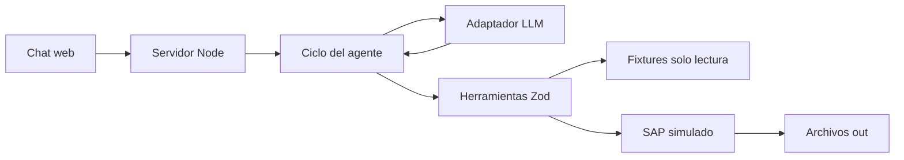

# Solución — Reto 03

## 1. Problema

El equipo de compras transcribe y verifica manualmente solicitudes; el agente prepara la orden, valida autoridad y montos y hace visibles las excepciones antes de crearla.

## 2. Arquitectura

El prompt vive en `agent/prompt.md`, el conocimiento en `src/knowledge/ordenes-compra.md`, las herramientas en `src/tools/oc.ts`, los controles en `src/domain/` y la interfaz SAP en `src/sap/adapter.ts`. Las herramientas pueden ejecutarse sin servidor ni LLM desde demo.ts. No hay base de datos ni integración real con correo.

Dependencias: Zod valida argumentos y contratos de datos; TypeScript comprueba tipos; tsx ejecuta los archivos TypeScript en desarrollo, pruebas y demo; dotenv carga opcionalmente `.env` en backend sin exigir características recientes de Node. La API del proveedor usa fetch nativo y la interfaz usa HTML/CSS/JS sin dependencias de navegador.

## 3. Ciclo del agente

El backend conserva la sesión, envía historial y herramientas al adaptador, valida los argumentos con Zod, ejecuta cada herramienta y retorna los resultados al modelo hasta que responde o alcanza el límite. Los resultados estructurados son la fuente de datos; el modelo comunica y orquesta.

Las confirmaciones son permisos controlados por la sesión, vinculados al caso pendiente y al siguiente mensaje humano. El modelo no puede autorizarse enviando un booleano. Una negación o cambio de caso no confirma una orden pendiente. Los bloqueos son definitivos hasta corregir el insumo. Antes de crear se revalidan los datos originales y el payload: la confirmación no permite cambiar montos silenciosamente.

Cada llamada se muestra en el chat y registra en JSONL. Los errores se devuelven como JSON legible, no excepciones crudas. Hay presupuestos de iteraciones y tokens y timeout del proveedor. Los defaults reservan 400.000 unidades por sesión y 1.000.000 por proceso. Son bytes de entrada y reservas de salida, no tokens facturados. Una secuencia instrumentada de compra normal más vista previa y confirmación reservó 342.993 unidades con cuotas activas. Si el límite llega después de crear, se conserva el número de OC de la herramienta. El log usa el mismo control de rutas confinadas que las salidas. El estado del simulador se transmite como datos tipados separados del prompt. El modo offline usa un simulador explícito para pruebas; no prueba comportamiento de un LLM real. Para el modelo local, el ciclo permite hasta dos correcciones dentro del mismo turno si el modelo termina antes de una herramienta necesaria. Esas correcciones no conceden autorización ni cambian el caso. La respuesta de creación se construye con el número devuelto por oc_crear, descartando afirmaciones de creación no verificadas; una vista previa requiere validación y payload.

## 4. Modelo y coste

Se eligió Qwen3 4B Instruct 2507 Q4_K_M (`qwen3:4b-instruct-2507-q4_K_M`) servido con Ollama en este equipo. Tiene unos 2,5 GB de pesos y licencia Apache 2.0. El equipo dispone de RTX 2060 de 6 GB y 16 GB de RAM. La variante Instruct respondió de forma directa en español durante la comprobación inicial; la variante Qwen3 4B inicial generaba razonamiento y no resultó adecuada para la latencia buscada. En este equipo, los turnos de inferencia medidos tardaron entre 15 y 63 segundos, salvo una negación de 1,4 segundos. La latencia depende del hardware y del contexto.

El adaptador nativo usa `/api/chat`, mensajes y argumentos de herramientas como objetos, `tool_name` en los resultados, salida sin streaming, temperatura 0, contexto de 16.384 y límite configurable de salida. El backend acepta únicamente HTTP loopback para este adaptador, rechaza redirecciones y nombres de modelo de nube, y no envía cabeceras de autorización. El lanzador inicia Ollama con `OLLAMA_NO_CLOUD=1`, escucha local y una carga de modelo. Activa Flash Attention y caché KV q8_0: en este equipo el modelo y su contexto quedaron completamente en la GPU, aproximadamente 3,9 GB según Ollama. La descarga inicial usa internet; el procesamiento del modelo se realiza localmente. Si se reutiliza un proceso Ollama preexistente, su configuración pertenece a ese proceso.

No hay facturación por token a un proveedor de inferencia: el coste operativo es cómputo, memoria y electricidad del equipo, que no se midió. Se conservan cuotas para acotar tiempo y recursos; sus unidades conservadoras reservadas no son tokens facturados. El contador global se reinicia al reiniciar el servidor. Los pesos son preentrenados por Qwen, no entrenados por nosotros. Nuestro desarrollo comprende aplicación, agente, herramientas e integración.

El adaptador Chat Completions externo sigue disponible como alternativa opcional. Solo al elegir ese modo se necesita una clave y se envían mensajes al proveedor seleccionado. El modo offline sigue siendo un simulador explícito para pruebas sin inferencia.

Fuentes oficiales: [modelo y licencia](https://ollama.com/library/qwen3:4b-instruct-2507-q4_K_M), [API de chat y herramientas](https://docs.ollama.com/api/chat), [privacidad y desactivación de nube](https://docs.ollama.com/faq).

## 5. Matriz de controles

| Regla | Conducta |
|---|---|
| RC1 | Proveedor por NIT o nombre normalizado, existente y activo; bloqueo |
| RC2 | Aprobación explícita y remitente autorizado para centro; bloqueo |
| RC3 | Total dentro del tope del aprobador; bloqueo |
| RC4 | Subárea perteneciente al centro; bloqueo |
| RC5 | Diferencia relativa de cotización superior al 2% o cotización ausente; confirmación |
| RC6 | IVA faltante derivado del proveedor; confirmación |
| RC7 | Condición de pago faltante derivada del proveedor; informar |
| RC8 | Factura anterior a solicitud; marcar retroactiva y confirmar |
| RC9 | Aprobación anterior a solicitud; confirmación |
| RC10 | Cantidad por precio unitario difiere del total en más de una unidad; bloqueo |

El control más delicado es la frontera entre confirmación y autorización: una conversación no puede saltarse bloqueos ni sustituir el importe aprobado con el cotizado. Además se validan catálogos, valores finitos y fechas antes de producir datos.

## 6. Adaptador SAP real

Primero confirmar versión de SAP, interfaces habilitadas y autorización con el equipo de integración. Si existe API de órdenes de compra autorizada, usar un servicio de integración backend que implemente SapAdapter y adapte nuestro payload a los campos de cabecera, proveedor, posiciones e imputación correspondientes a esa versión. OData es la primera opción a evaluar; en sistemas que solo permitan RFC, evaluar BAPI_PO_CREATE1 mediante middleware autorizado. Estos nombres son candidatos de integración del PRD, no interfaces probadas en esta entrega.

Mapeo conceptual: sociedad y organización de compras a cabecera; código SAP del proveedor a proveedor; moneda y términos de pago a condiciones; posiciones a número, texto breve, cantidad, unidad, precio y centro de costo; evidencia y referencia externa a adjuntos/extensiones permitidas por la instalación. Comprobar si precios esperados son netos o brutos: los fixtures usan importes con IVA, lo cual exige un mapeo fiscal acordado en producción, no conversión silenciosa.

Credenciales de servicio en un gestor de secretos, nunca en prompt. TLS, mínimo privilegio, auditoría e identidad del usuario separada del modelo. Conservar solicitud_id como referencia idempotente y persistir estados pendiente/enviado/confirmado/fallido. Ante timeout consultar la referencia antes de reintentar; ante error parcial reconciliar el estado real y no repetir a ciegas. Un número retornado por SAP solo se acepta después de validar la respuesta.

Plan B: producir un archivo de carga o una orden revisada lista para digitación manual, con trazabilidad y evidencia, sin afirmar creación en SAP. Validar la API y sus límites en sandbox corporativo antes de implementar el adaptador real.

## 7. Compras retroactivas

Una factura previa a la solicitud indica que el gasto se comprometió antes del control. Registrar la orden permite tramitarla, pero no demuestra que el proceso haya sido correcto. Informaría a dirección el porcentaje y monto de compras retroactivas, centros afectados y tiempos entre factura y aprobación. Separaría urgencias justificadas de incumplimientos recurrentes, sin inferir intención a partir de una sola factura.

Propondría que la solicitud y aprobación antecedan al compromiso con el proveedor; definiría un canal de urgencias con responsable, plazo de regularización y evidencia. La política de permitir o rechazar compras retroactivas pertenece a dirección y control interno. El agente aplica la regla del reto: las marca, solicita confirmación y deja rastro. En producción esa confirmación requiere identidad verificable; escribir “confirmo” en un chat público no acredita autoridad corporativa.

## 8. Decisiones y alternativas

1. Node HTTP y frontend estático frente a React/framework full stack: menos dependencias y un proceso de arranque; se acepta menor modularidad visual.
2. Reglas deterministas frente a decisiones de aprobación por LLM: reproducibilidad, trazabilidad y pruebas sin clave; el LLM mantiene la conversación.
3. Archivos frente a base de datos: cumple el alcance y facilita inspección; solo una instancia y migración necesaria para producción.
4. Evidencia TXT P0 frente a PDF P1: conserva encabezados, contenido y hash; PDF y lectura de Excel quedan como extensión opcional.
5. Adaptador configurable frente a acoplar SDK al servidor: cambio de proveedor contenido y pruebas con adaptador guionado.

## 9. Supuestos

Los fixtures son ficticios y representan los maestros autorizados. Las solicitudes JSON sustituyen al Excel de entrada. El correo de aprobación es evidencia suficiente para el reto. La instalación local configura Ollama y el modelo; el alojamiento público sigue siendo una decisión de despliegue. Los controles del mock no equivalen a autorización corporativa. Una confirmación valida la excepción informada, no corrige el archivo original ni elimina un bloqueo.

## 10. Cobertura

| Historia | Estado y alcance |
|---|---|
| HU1 leer paquete | Hecho P0: normalización de correo, solicitud, cotización, aprobación y factura |
| HU2 controles | Hecho P0: RC1–RC10 y clasificación de bloqueo/confirmación/derivado |
| HU3 payload | Hecho P0: esquema Zod y trazabilidad por campo |
| HU4 evidencia | Hecho P0: TXT y SHA256; PDF P1 no implementado |
| HU5 creación | Hecho P0: mock, secuencia, idempotencia y control CSV; concurrencia entre procesos probada |
| HU6 errores | Hecho P0: respuestas JSON y continuidad del lote |

La implementación se verificó con typecheck y 48 pruebas aprobadas; una prueba de enlace simbólico se omitió por permisos de Windows. La suite de desarrollo no se incluye en este paquete de entrega. Se comprobaron los seis casos con inferencia local real, incluyendo bloqueos, confirmaciones e idempotencia. La URL pública sigue pendiente. Para producción faltan identidad y roles, persistencia distribuida, integración SAP, gestión de secretos, reconciliación y pruebas con documentos reales. El módulo reutilizable de bonus no se incluye.

## 11. Riesgos y mitigaciones

Errores del modelo: herramientas autoritativas y revalidación al crear. Entrada malformada: Zod, normalización y errores tipados. Duplicación: idempotencia y serialización en mock; almacenamiento transaccional en producción. Consumo de API: límites de salida, iteraciones y presupuestos; añadir límites de facturación del proveedor. Manipulación de documentos: tratarlos como datos, no instrucciones; validar desde fuente. Credenciales: variables secretas backend. Exposición pública: datos ficticios, mínimos endpoints y límites; añadir acceso controlado al desplegar si es necesario. Reinicio de servidor: las sesiones en memoria se pierden y los presupuestos se reinician; documentar el alcance, usar almacenamiento durable en producción.
